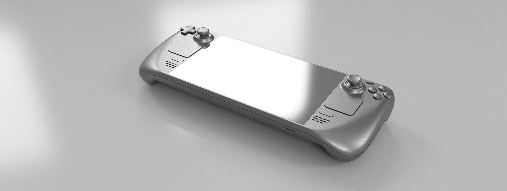
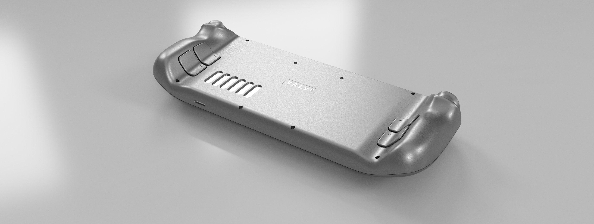
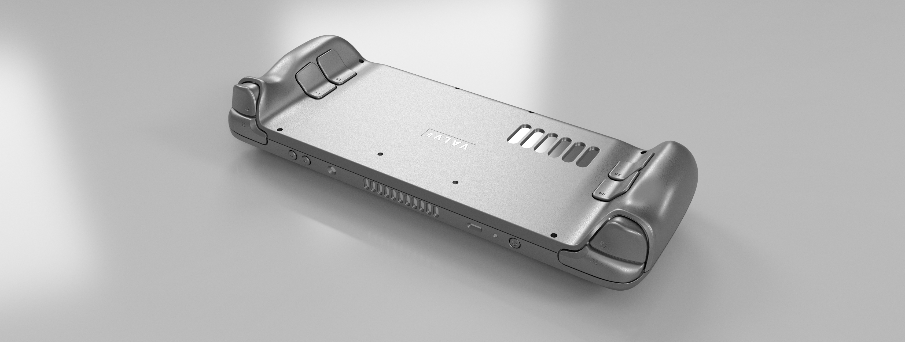
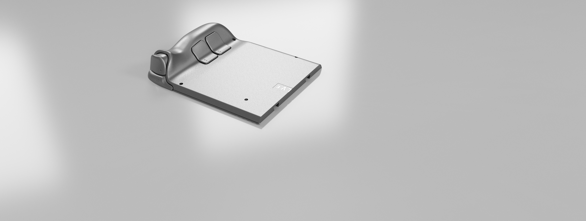

# steamdeck-split-keyed
Valve's Steam Deck Models that have been split and keyed for easier FDM printing.

*All credit goes to Valve for releasing the source files for the steamdeck*

## Link:

https://gitlab.steamos.cloud/SteamDeck/hardware/-/tree/master

## Photos:

